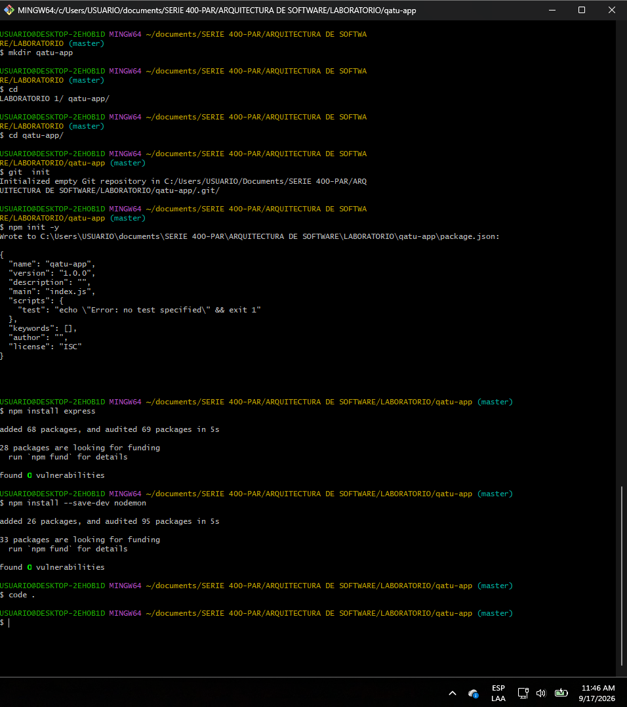
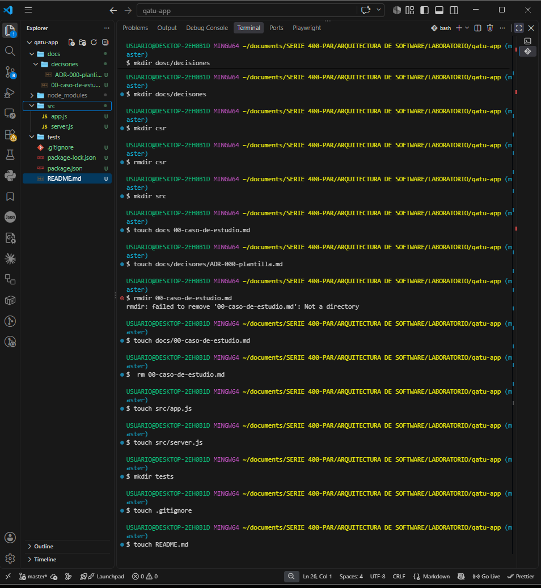

# Laboratorio 1 — Arquitectura de Software

## Información del estudiante

- **Nombre completo:** Noé Yupanqui Santiago
- **Carrera:** Ingeniería de Sistemas
- **Universidad:** Universidad Nacional de San Cristóbal de Huamanga (UNSCH)

## Descripción del curso

El curso de Arquitectura de Software permite conocer y aplicar principios,
patrones y buenas prácticas para diseñar sistemas de software organizados,
mantenibles, escalables y confiables.

## Expectativas del estudiante

Espero adquirir conocimientos para diseñar arquitecturas de software,
comprender la organización de sistemas y aplicar buenas prácticas en el
desarrollo de proyectos reales.
como tambien implmentarlo en el mundo laboral real.

## Docente

- **Nombre completo:** ING. LIZBETH JAICO QUISPE

## Evidencias

### Paso 1: Configuración inicial del proyecto

### Paso 2: Creación de la estructura de carpetas

